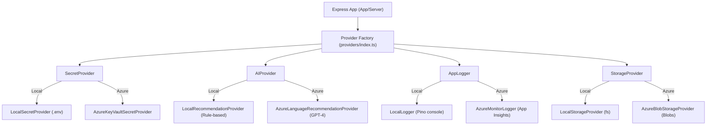

# PulseCare

[](https://www.typescriptlang.org/)
[](https://react.dev/)
[](https://vitejs.dev/)
[](https://tailwindcss.com/)
[](https://nodejs.org/)
[](https://expressjs.com/)
[](https://www.prisma.io/)
[](https://www.sqlite.org/)
[](https://azure.microsoft.com/)

PulseCare is a full-stack health and wellness platform built with Node.js/Express and React. It implements role-based access control for patients, doctors, and administrators, allowing users to log biometrics, schedule appointments, and receive automated diagnostic recommendations. By default, the application runs locally using a SQLite database managed via Prisma. It contains optional Microsoft Azure integration points (Key Vault, OpenAI, Blob Storage, Application Insights) that are wired using runtime feature flags and run in simulation/fallback mode locally when the cloud credentials or SDKs are not present.

## Architecture

This project follows Clean Architecture and SOLID design principles. Core business logic is decoupled from frameworks, databases, and third-party SDKs, allowing individual parts of the system to be developed and tested in isolation.

To manage cloud resources, the application uses Dependency Inversion combined with ES6 Proxy-wrapped Lazy Factories. Instead of importing Azure SDKs directly, providers are dynamically resolved at runtime based on environment configuration flags. This approach prevents the local environment from crashing if Azure credentials are missing or if the Azure SDK packages are not installed, since dependencies are loaded dynamically only when the respective service is enabled.

### Implementation Status
* **Local Path**: Fully implemented and functional. Vitals logging, appointments scheduling, and recommendation history work end-to-end using Prisma and SQLite. Logging defaults to a local console stream via Pino, files are stored on the local disk, and recommendation generation runs on a local rule-based fallback provider. Authentication uses JWT with bcrypt password hashing.
* **Azure Integration**: Implemented as toggleable runtime stubs. The code is structured to dynamically load `@azure` SDKs or execute HTTP fallback requests when flags are enabled, but these integrations have not been run or tested in a production environment.
* **Testing**: Currently, no unit or integration tests are implemented; the test configuration scripts are in place but are set to pass on empty runs.

### Lazy Factory Provider Resolution


## Tech Stack
* **Frontend**: React 18, Vite, TypeScript, Recharts (theme-linked charts), Framer Motion (page transitions), React Hook Form, Axios, React Router.
* **Backend**: Node.js, Express, TypeScript, Prisma, Pino (logging), Zod (input validation), JSON Web Tokens (JWT) for authentication, and bcrypt for password hashing.
* **Database**: SQLite (managed via Prisma).
* **UI styling**: Tailwind CSS and custom theme configurations supporting light mode, dark mode (default), and system preference matching.

## Database Schema
The database uses SQLite, which was chosen to simplify local setup and avoid the overhead of running a separate database server during development. The tables are mapped via Prisma as follows:


## Setup and Local Run
### Prerequisites
* Node.js (v20.x or higher)
* npm (v10.x or higher)

### Installation
1. Install dependencies at the monorepo root:
   ```bash
   npm install
   ```
2. Set up and seed the SQLite database:
   ```bash
   npx prisma db push
   ```
   This generates the Prisma client and seeds the database with 1 Admin user, 2 Doctor profiles, 5 Patient profiles, and mock health metrics history.
3. Start the development servers:
   ```bash
   npm run dev
   ```
   * Backend API: `http://localhost:5000/api`
   * React Client: `http://localhost:3000`

## Production Deployment
### Backend (Render Web Service)
* **Build Command**: `npm run build`
* **Start Command**: `npm run start`
* **Required Environment Variables**:
  ```env
  PORT=5000
  NODE_ENV=production
  DATABASE_URL="file:./dev.db"
  FRONTEND_URL="https://your-frontend-app.vercel.app"
  JWT_ACCESS_SECRET="your-access-secret-token"
  JWT_REFRESH_SECRET="your-refresh-secret-token"
  ```
* **Persistent Disk**: Configure a persistent disk mount at `/backend/prisma/` to prevent loss of the `dev.db` database file on redeployment.

### Frontend (Vercel SPA)
* **Build Command**: `npm run build`
* **Output Directory**: `dist`
* **Required Environment Variables**:
  ```env
  VITE_API_URL="https://your-backend-app.onrender.com/api"
  ```

## Optional Cloud Configurations
To test or configure Azure integration options locally or in production, add the following feature flags and variables to your environment configuration:

```env
# 1. Key Vault (Secure Credentials)
USE_AZURE_KEYVAULT=true
AZURE_KEYVAULT_URL="https://your-vault.vault.azure.net/"

# 2. Azure OpenAI (Automated Biometric Summaries)
USE_AZURE_AI=true
AZURE_AI_ENDPOINT="https://your-openai-endpoint.openai.azure.com/"
AZURE_AI_API_KEY="your-api-key"
AZURE_AI_DEPLOYMENT_NAME="gpt-4"

# 3. Application Insights (Telemetry Streams)
USE_AZURE_MONITOR=true
APPLICATIONINSIGHTS_CONNECTION_STRING="InstrumentationKey=your-key..."

# 4. Blob Storage (Static Assets)
USE_AZURE_STORAGE=true
AZURE_STORAGE_CONNECTION_STRING="DefaultEndpointsProtocol=https;AccountName=..."
```
