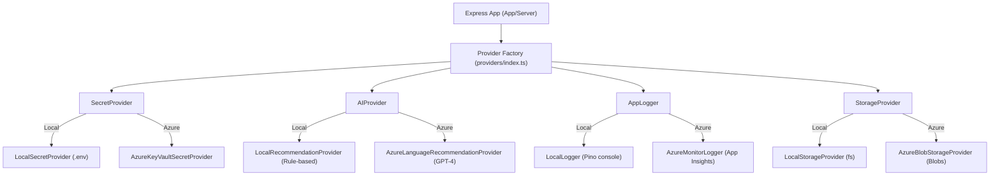
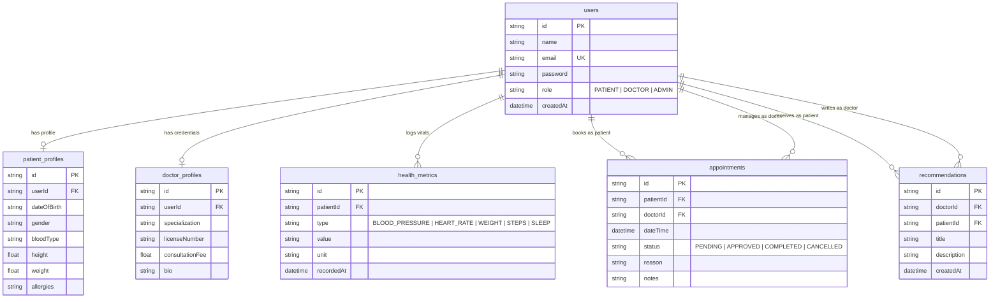

# 🏥 PulseCare: Enterprise-Grade Personalized Healthcare & Wellness Platform

[](https://www.typescriptlang.org/)
[](https://react.dev/)
[](https://vitejs.dev/)
[](https://tailwindcss.com/)
[](https://nodejs.org/)
[](https://expressjs.com/)
[](https://www.prisma.io/)
[](https://www.sqlite.org/)
[](https://azure.microsoft.com/)

PulseCare is a secure, role-based, full-stack digital health and wellness platform designed with **Clean Architecture** and **SOLID principles**. It provides patients, clinicians, and administrators with real-time biometric metrics tracking, appointment scheduling, and automated AI diagnostic recommendations.

The platform is designed to run locally on a lightweight **SQLite database** by default, while exposing optional cloud-ready **Microsoft Azure** integration points (Key Vault, OpenAI, Blob Storage, Application Insights) that can be toggled on instantly via configuration.

---

## 🎨 Professional Design System & UI/UX

*   **Dark Mode by Default**: Enterprise SaaS dashboard layout featuring cohesive medical dark styling (Background `#121212`, Cards `#222222`, Accents in brand blue `#4F8CFF` and success green `#4ADE80`).
*   **Three-Way Theme Selector**: Instantly cycle between **Light Mode** (Amber Sun), **Dark Mode** (Brand Blue Moon), and **System Preferences** (Purple Monitor).
*   **Monospace Typography**: Styled globally in **Consolas** with a custom tracking scale (`+0.04em` letter-spacing) for high-readability telemetry, tables, and charts.
*   **Interactive Visual Analytics**: Interactive Area and Bar charts utilizing Recharts, dynamically matching the selected theme.

---

## 🏗️ System Architecture & Abstraction Layers

PulseCare implements **Dependency Inversion** to keep core business logic decoupled from external SDK libraries. Every cloud resource is accessed through abstraction interfaces and resolved at runtime via **ES6 Proxy-wrapped Lazy Factories**. This eliminates circular module deadlocks and prevents local startups from crashing if Azure SDKs are not installed:



---

## 🗄️ Relational Database Schema (SQLite via Prisma)

The database schema manages user roles, clinical profiles, biometric logs, and recommendations:



---

## 🚀 Getting Started (Local Setup)

Install dependencies and start the local environment in seconds using mono-repo root commands.

### Prerequisites
*   [Node.js](https://nodejs.org/) (v20.x or higher)
*   [npm](https://www.npmjs.com/) (v10.x or higher)

### Setup & Run
1.  **Clone the repository and install all dependencies**:
    ```bash
    npm install
    ```
2.  **Synchronize and seed the SQLite database**:
    ```bash
    npx prisma db push
    ```
    *This generates the Prisma client and provisions the database with 1 Admin, 2 Doctors, 5 Patients, and historical health records.*
3.  **Launch the development server**:
    ```bash
    npm run dev
    ```
    *   Backend API: http://localhost:5000/api
    *   React Client: http://localhost:3000

---

## 🌐 Production Deployment Configurations

PulseCare is optimized for hosting on **Render** (Backend) and **Vercel** (Frontend).

### 1. Backend Config (Render Web Service)
*   **Build Command**: `npm run build`
*   **Start Command**: `npm run start`
*   **Environment Variables**:
    ```env
    PORT=5000
    NODE_ENV=production
    DATABASE_URL="file:./dev.db"
    FRONTEND_URL="https://your-frontend-app.vercel.app"
    JWT_ACCESS_SECRET="your-access-secret-token"
    JWT_REFRESH_SECRET="your-refresh-secret-token"
    ```
*   *Note: Set up a disk mount point on Render at `/backend/prisma/` to ensure your database file (`dev.db`) is preserved across deployments.*

### 2. Frontend Config (Vercel SPA)
*   **Build Command**: `npm run build`
*   **Output Directory**: `dist`
*   **Environment Variables**:
    ```env
    VITE_API_URL="https://your-backend-app.onrender.com/api"
    ```

---

## ☁️ Activating Azure Integrations (Optional)

When deploying to Azure, toggle on specific services by adding feature flags to your environment settings:

```env
# 1. Key Vault (Secure Credentials)
USE_AZURE_KEYVAULT=true
AZURE_KEYVAULT_URL="https://your-vault.vault.azure.net/"

# 2. Azure OpenAI (Automated Biometric Summaries)
USE_AZURE_AI=true
AZURE_AI_ENDPOINT="https://your-openai-endpoint.openai.azure.com/"
AZURE_AI_API_KEY="your-api-key"
AZURE_AI_DEPLOYMENT_NAME="gpt-4"

# 3. Application Insights (Telemetry Streams)
USE_AZURE_MONITOR=true
APPLICATIONINSIGHTS_CONNECTION_STRING="InstrumentationKey=your-key..."

# 4. Blob Storage (Static Assets)
USE_AZURE_STORAGE=true
AZURE_STORAGE_CONNECTION_STRING="DefaultEndpointsProtocol=https;AccountName=..."
```
