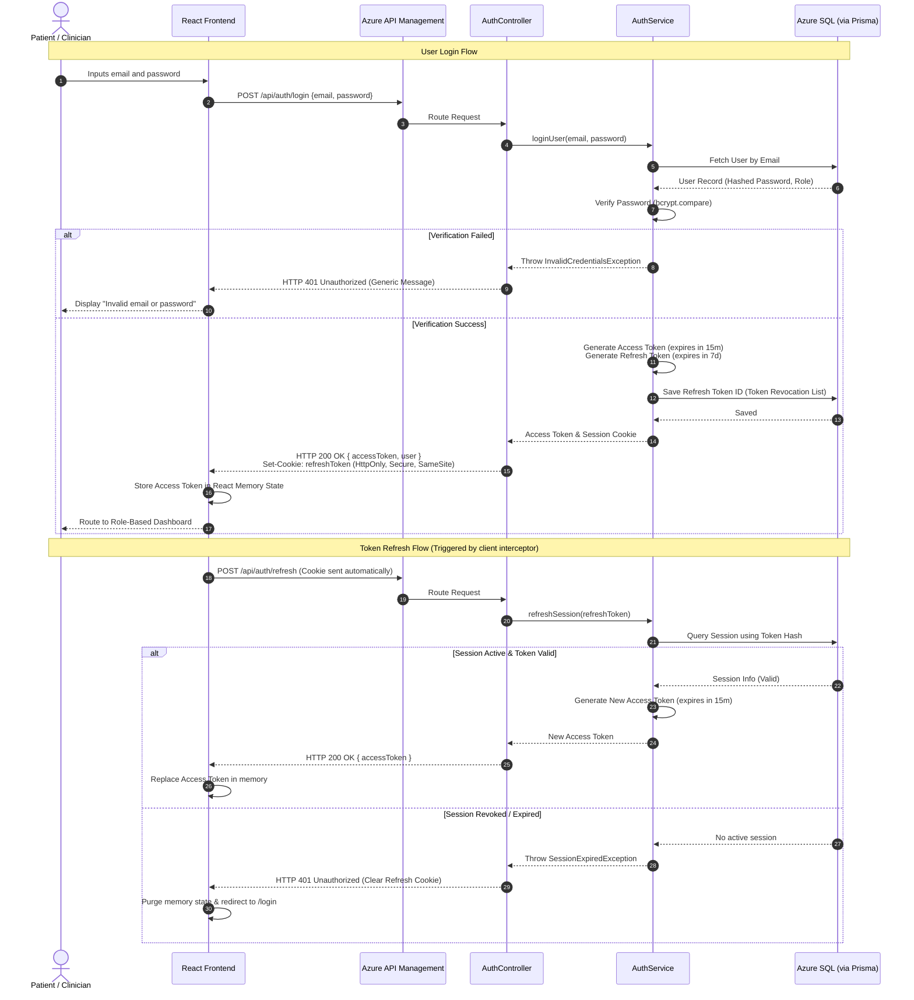

# Authentication & Authorization Flows

This document outlines the authentication protocols, user registration and login workflows, JWT lifecycles, and access control policies.

---

## 1. Authentication Overview
The platform utilizes stateless **JSON Web Token (JWT)** authentication to manage sessions securely, combined with **Role-Based Access Control (RBAC)** to restrict unauthorized access to medical resources.

### 1.1 Key Security Mechanisms
*   **Access Token:** Short-lived JWT (15-minute expiration) containing the user’s identity (`userId`) and authorized scopes/roles. Stored in memory on the client side and sent via the `Authorization: Bearer <token>` header.
*   **Refresh Token:** Long-lived JWT (7-day expiration) stored in an `HttpOnly`, `Secure`, `SameSite=Strict` cookie. Used exclusively to obtain new Access Tokens.
*   **Hashing:** User passwords are encrypted using `bcrypt` (using a cost factor of 10) before database storage.
*   **Secrets Store:** JWT signing keys are retrieved at runtime from **Azure Key Vault**.

---

## 2. Mermaid Sequence Diagram



---

## 3. Detailed Flows

### 3.1 Registration Flow
1.  **Request Submission:** The user fills out the registration form. The client application posts demographic information, email, and password to `/api/auth/register`.
2.  **Schema Validation:** The API Gateway (APIM) forwards the request. The backend Router runs inputs through a Zod schema validation layer. If invalid, it returns `HTTP 400 Bad Request`.
3.  **Conflict Check:** The service layer queries the repository to check if the email is already registered. If a match exists, it rejects the request with `HTTP 409 Conflict`.
4.  **Password Hashing:** The service generates a salt and hashes the plaintext password via `bcrypt`.
5.  **Database Persistence:** A transaction is opened using Prisma. The user entity is created with a default role of `PATIENT`. An audit event log is simultaneously written to track account creation.
6.  **Token Issuance:** Upon database commit, access and refresh tokens are generated, and a successful registration response is returned.

### 3.2 Login Flow
1.  **Request Submission:** The user posts credentials to `/api/auth/login`.
2.  **Credential Lookup:** The database is queried for the user record.
3.  **Verification:** The input password is verified against the database hash using `bcrypt.compare()`.
4.  **Session Logging:** If verification succeeds, a record is added to the user's active session tracking table, allowing individual devices to be tracked and revoked.
5.  **Response Construction:** The client receives the JWT Access Token in the JSON body, and the Refresh Token via a secure cookie.

### 3.3 JWT Lifecycle Management
*   **Generation:** Tokens are signed using asymmetric HS256/RS256 algorithms. The private signing key is rotated periodically inside Azure Key Vault.
*   **Claims Payload:** The Access Token includes the following claims:
    ```json
    {
      "sub": "usr_9827341",
      "email": "patient@example.com",
      "role": "PATIENT",
      "iat": 1783478400,
      "exp": 1783479300
    }
    ```
*   **Storage Rules:**
    *   **Access Token:** Maintained purely in the application's RAM (React component state). **Never** stored in `localStorage` or `sessionStorage` to mitigate Cross-Site Scripting (XSS) extraction risks.
    *   **Refresh Token:** Configured with `HttpOnly` (inaccessible to JavaScript), `Secure` (only transmitted over HTTPS), and `SameSite=Strict` (mitigates Cross-Site Request Forgery - CSRF).
*   **Revocation:** When a user logs out, the logout endpoint removes the active session mapping from the SQL database and returns an expired header to clear the client cookie.

---

## 4. Role-Based Authorization (RBAC)

### 4.1 Define Roles
The application enforces three user roles:
1.  **PATIENT:** Allowed to view their own metrics, manage appointments, input health journals, and receive recommendations.
2.  **CLINICIAN:** Allowed to view metric dashboards of patients assigned to them, schedule/conduct appointments, write clinical notes, and view AI recommendations.
3.  **ADMIN:** Allowed system configuration, auditing logs, access control management, and manual override of integrations.

### 4.2 Middleware Enforcement
The server uses an Express middleware pattern to check scopes:
```typescript
// Example usage: router.get('/clinical-notes', authorizeRoles('CLINICIAN', 'ADMIN'), notesController);
```
The middleware extracts the token from the header, validates its expiration and signature, reads the `"role"` claim, and evaluates it against the accepted parameters. If the role is missing or insufficient, it immediately halts request processing and returns `HTTP 403 Forbidden`.
