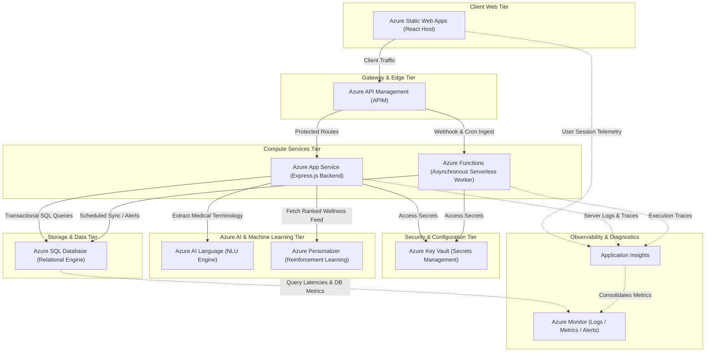

# Azure Cloud Infrastructure Architecture

This document outlines the cloud topology, lists the utilized Microsoft Azure services, explains their architectural responsibilities, and provides a structural resource map.

---

## 1. Cloud Infrastructure Diagram

---

## 2. Azure Service Mapping & Rationales

### 2.1 Azure Static Web Apps (SWA)
*   **Target Module:** Frontend UI (React, TypeScript, Tailwind CSS).
*   **Purpose:** Securely hosts static assets (HTML, CSS, JS) with built-in global content delivery network (CDN) caching, automatic SSL renewal, and tight integration with GitHub Actions for deployment.

### 2.2 Azure API Management (APIM)
*   **Target Module:** Gateway Ingress Routing & API Policy Management.
*   **Purpose:** 
    *   Acts as a reverse proxy, exposing a single secure endpoint for the frontend.
    *   Enforces rate-limiting policies to prevent denial-of-service attempts.
    *   Authenticates incoming JWT signatures at the routing boundary before letting requests touch compute services.
    *   Centralizes CORS configuration and API documentation.

### 2.3 Azure App Service
*   **Target Module:** Application logic server (Node.js/Express.js).
*   **Purpose:** Hosts the main Express application. Azure App Service provides horizontal autoscaling, blue-green deployments (using deployment slots), custom domains, and native environment integration, making it ideal for running containerized or raw Node.js backend runtimes.

### 2.4 Azure Functions
*   **Target Module:** Scheduled Tasks & Event-Driven Processors.
*   **Purpose:** Executed using serverless compute. Azure Functions run background code in response to specific triggers:
    *   **Timer Trigger:** Scheduled cron jobs run nightly to check user metrics and send medication reminders.
    *   **Queue Trigger:** Ingests incoming batch data feeds from wearables (Fitbit, Apple Health) asynchronously, ensuring the main application server is not blocked.

### 2.5 Azure SQL Database
*   **Target Module:** Data Persistence (Relational Database).
*   **Purpose:** A cloud-native, relational SQL database. It provides high availability, automatic scaling (Serverless tier with auto-pause), automatic database tuning, and full compatibility with Prisma ORM.

### 2.6 Azure Key Vault
*   **Target Module:** Secrets & Credentials Management.
*   **Purpose:** Solves the security risk of code-level configuration leakage. Holds sensitive assets including JWT private keys, database connection strings, and external API keys. App Service and Azure Functions fetch these values directly into environment RAM at startup using Azure Managed Identities.

### 2.7 Azure AI Language
*   **Target Module:** Clinical Notes Processing (Doctor Portal).
*   **Purpose:** Integrates Cognitive NLU models into the clinician workflow. When a doctor writes clinical notes, Azure AI Language parses the text to automatically extract medical terms, identify medication dosages, recognize symptoms, and categorize these details into structured JSON records.

### 8.8 Azure Personalizer
*   **Target Module:** AI Recommendation Engine (Patient Dashboard).
*   **Purpose:** A cloud-based service that runs reinforcement learning algorithms. It accepts context features (such as current activity logs, time of day, patient age, and logged goals) and returns a ranked list of wellness activities. It tracks patient interactions (clicks/engagement) and records reward metrics to continuously train and optimize its model.

### 2.9 Azure Monitor & Application Insights
*   **Target Module:** Application Observability, Log Management, and Alerts.
*   **Purpose:**
    *   **Application Insights:** Instruments the Express application and React UI, capturing AJAX latency, exception details, routing speeds, and live user logs.
    *   **Azure Monitor:** Displays centralized operation dashboards, tracks server resource constraints, and triggers immediate alerts (e.g., Slack or email) when API failure rates cross defined thresholds.
