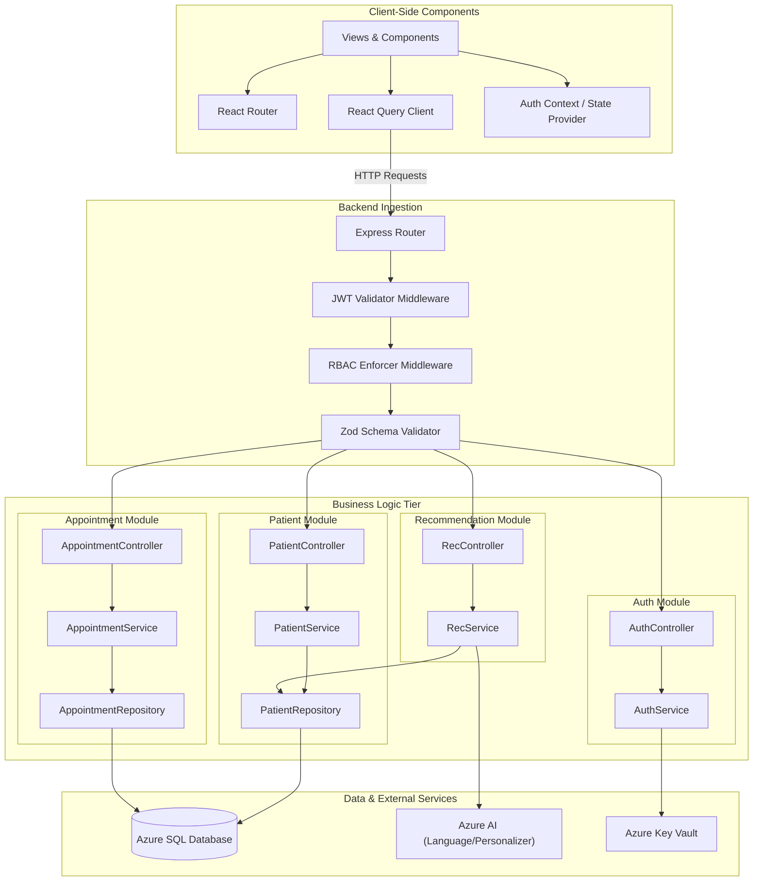

# Component Architecture

This document describes the structural decomposition of the frontend and backend applications, defines component boundaries, outlines architectural patterns, and detail service responsibilities.

---

## 1. Architectural Pattern: Controller-Service-Repository
The backend codebase implements the **Controller-Service-Repository** design pattern. This enforces clean separation of concerns, simplifies unit testing, and decouples web-framework logic from database operations and business logic.

```
       ┌───────────────────────┐
       │     Client Request    │
       └───────────┬───────────┘
                   │
                   ▼
┌─────────────────────────────────────┐
│          Controller Layer           │  <-- Parses HTTP parameters, validates inputs,
│    (e.g., PatientController.ts)     │      and returns HTTP responses.
└──────────────────┬──────────────────┘
                   │
                   ▼
┌─────────────────────────────────────┐
│            Service Layer            │  <-- Contains core domain rules, coordinates
│      (e.g., PatientService.ts)      │      external integrations (Azure AI, Wearables).
└──────────────────┬──────────────────┘
                   │
                   ▼
┌─────────────────────────────────────┐
│          Repository Layer           │  <-- Executes queries using Prisma Client,
│      (e.g., PatientRepository.ts)   │      abstracting database engines.
└──────────────────┬──────────────────┘
                   │
                   ▼
       ┌───────────────────────┐
       │   Azure SQL Database  │
       └───────────────────────┘
```

### 1.1 Layer Responsibilities

1.  **Controller Layer:**
    *   Acts as the HTTP interface.
    *   Extracts payload structures, URL parameters, query strings, and user details from incoming requests.
    *   Delegates actual workload to the corresponding Service component.
    *   Returns structured HTTP responses with standardized JSON formats and HTTP status codes (e.g., 200 OK, 201 Created, 400 Bad Request, 500 Server Error).
2.  **Service Layer:**
    *   Implements the core domain logic and business rules of the platform.
    *   Controls transaction boundaries where operations span multiple databases.
    *   Integrates with external API services (e.g., invoking Azure AI Language for text parsing, calling Azure Personalizer for recommendation ranks).
    *   Is independent of Express framework details, facilitating unit testing in isolation.
3.  **Repository Layer (Prisma Database Client):**
    *   Encapsulates all database-specific query logic.
    *   Provides high-level methods (e.g., `findById`, `createPatientProfile`, `updateHealthMetrics`) to the services.
    *   Uses Prisma client declarations to guarantee full TypeScript safety when querying the Azure SQL database.

---

## 2. Mermaid Component Diagram



---

## 3. Module Responsibilities & System Boundaries

### 3.1 Backend Modules

| Module Name | Responsibilities | Core Dependencies |
| :--- | :--- | :--- |
| **Authentication Module** | Handles user registration, credentials verification, password hashing, JWT generation, token refresh mechanisms, and OAuth mappings. | `bcrypt`, `jsonwebtoken`, Azure Key Vault |
| **Patient Module** | Manages patient medical profiles, demographics, daily wellness log tracking (e.g., steps, water intake, sleep data), and goal settings. | Prisma Client, Zod |
| **Doctor Portal Module** | Enables clinicians to view assigned patient dashboard metrics, write clinical health summaries, configure schedules, and manage clinical logs. | Prisma Client, Azure AI Language |
| **Appointment Module** | Coordinates clinic and telehealth appointments, manages clinician availability schedules, triggers calendar locks, and queue statuses. | Prisma Client, Azure Functions |
| **AI Recommendation Module** | Processes patient telemetry, constructs reward logs, queries recommended articles or daily actions, and processes feedback loop metrics. | Azure Personalizer, Azure AI Language |
| **Wearable Integration Module** | Integrates with Fitbit/Apple Health APIs to ingest wearable telemetry, triggering asynchronous aggregation jobs. | Azure Functions, Axios |

### 3.2 Frontend Modules

| Module Name | Responsibilities | Core Dependencies |
| :--- | :--- | :--- |
| **Auth Provider** | Manages application-wide login states, persists tokens to secure sessionStorage, and controls React Router route guards. | React Context, JWT Decode |
| **Metrics Dashboard** | Render interactive health charts, telemetry logs, and goals. Responsive grid display with custom widgets. | Recharts, Tailwind CSS |
| **Appointment Manager** | Interactive booking calendar showing clinician slots, appointment history, and real-time status. | React Day Picker |
| **AI Feed Component** | Displays context-driven wellness recommendations generated by Azure Personalizer and allows logging interactions (rewards). | Framer Motion (animations) |
