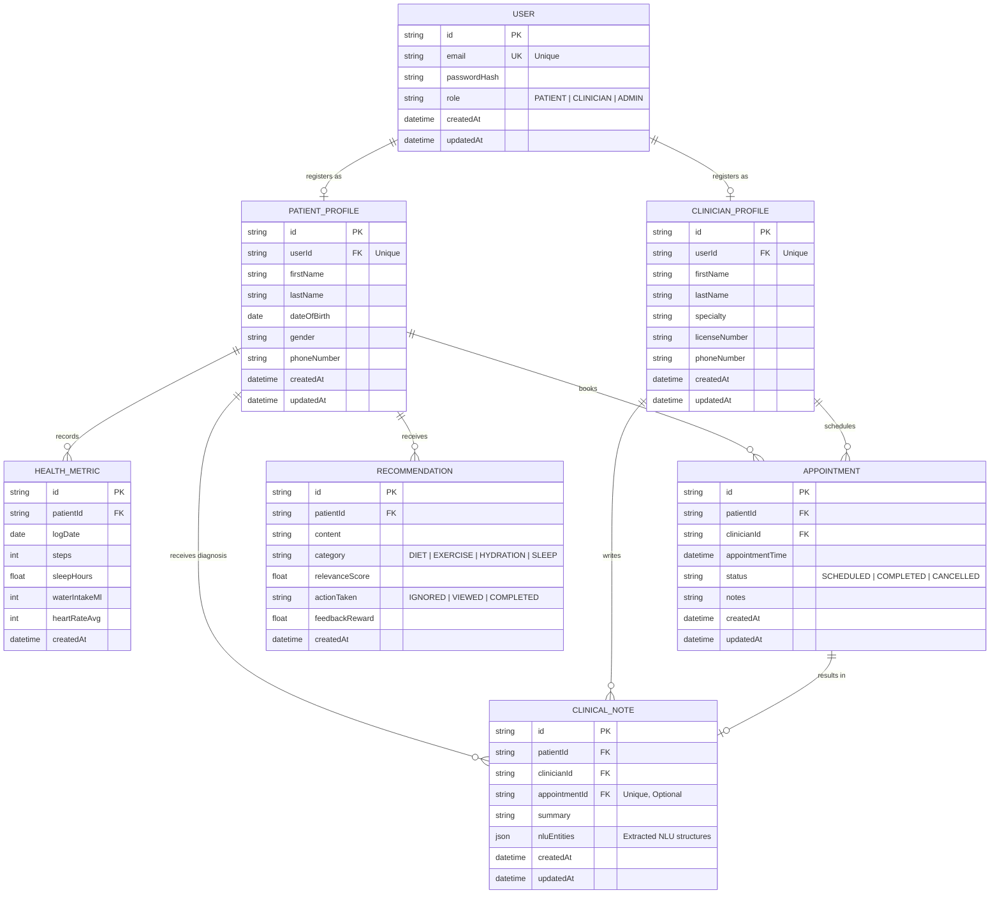

# Database Design

This document details the relational database schema, entity-relationship model, indexing strategies, and database design principles.

---

## 1. Database Overview
The storage tier utilizes **Azure SQL Database**, a fully managed relational database engine. Object-relational mapping is handled by **Prisma ORM**, which enforces schema consistency, compiles query code into highly optimized SQL, and generates type-safe database queries.

---

## 2. Entity-Relationship (ER) Diagram

---

## 3. Entity Dictionary

### 3.1 USER
*   **Purpose:** Stores baseline identity and authentication details for all system access.
*   **Key Attributes:** `id` (UUID Primary Key), `email` (Indexed, unique), `passwordHash` (stored as bcrypt hash), `role` (enforced as system enum: `PATIENT`, `CLINICIAN`, `ADMIN`).

### 3.2 PATIENT_PROFILE
*   **Purpose:** Houses demographic and healthcare-specific metadata for users registered with the `PATIENT` role.
*   **Key Attributes:** `userId` (foreign key pointing to User with unique constraint, enforcing a 1-to-1 relationship), `firstName`, `lastName`, `dateOfBirth`, `gender`.

### 3.3 CLINICIAN_PROFILE
*   **Purpose:** Contains profile details, license metadata, and medical specialty details for users registered under the `CLINICIAN` role.
*   **Key Attributes:** `userId` (foreign key pointing to User with unique constraint), `firstName`, `lastName`, `specialty`, `licenseNumber`.

### 3.4 HEALTH_METRIC
*   **Purpose:** Tracks daily wellness logs captured via user input or sync mechanisms.
*   **Key Attributes:** `patientId` (foreign key referencing Patient), `logDate` (type Date), `steps`, `sleepHours`, `waterIntakeMl`, `heartRateAvg`.
*   **Constraints:** Composite unique index on `(patientId, logDate)` to guarantee a patient has only one record per calendar day.

### 3.5 APPOINTMENT
*   **Purpose:** Manages scheduling availability, virtual meeting indicators, and status details.
*   **Key Attributes:** `patientId` (foreign key), `clinicianId` (foreign key), `appointmentTime` (timestamp), `status` (`SCHEDULED`, `COMPLETED`, `CANCELLED`).

### 3.6 RECOMMENDATION
*   **Purpose:** Tracks AI-generated recommendations and captures user interactions to calculate reinforcement learning feedback loops.
*   **Key Attributes:** `patientId` (foreign key), `content` (text recommendation), `relevanceScore` (confidence weight), `actionTaken` (`IGNORED`, `VIEWED`, `COMPLETED`), `feedbackReward` (numeric weight for reinforcement logic).

### 3.7 CLINICAL_NOTE
*   **Purpose:** Records medical summaries entered by clinicians, storing natural language processing outputs.
*   **Key Attributes:** `patientId` (foreign key), `clinicianId` (foreign key), `appointmentId` (optional unique foreign key linking to a specific appointment), `summary` (raw text), `nluEntities` (JSON representation of parsed medical concepts).

---

## 4. Design & Performance Principles

1.  **Strict Transaction Boundaries (ACID Compliance):**
    All write-heavy pathways—such as appointment bookings and user registrations—must run inside explicit database transactions. This prevents orphaned profiles or double-booked slots.
2.  **Relational Integrity (Foreign Keys & Cascades):**
    Referential integrity is strictly enforced at the database level. Deletion policies are carefully defined:
    *   Deleting a `User` will execute a `CASCADE` delete on `PatientProfile` or `ClinicianProfile`.
    *   Deleting a `PatientProfile` will be blocked (`RESTRICT`) if there are active `Appointments` or `ClinicalNotes` associated with them to prevent medical record loss.
3.  **Indexing Strategy:**
    To support query performance at scale:
    *   **Single-Column Indexes:** Created on high-selectivity lookup fields (`User.email`, `Appointment.appointmentTime`).
    *   **Composite Indexes:** Created on querying ranges (`HealthMetric.patientId` + `HealthMetric.logDate`, `Appointment.clinicianId` + `Appointment.appointmentTime`).
4.  **Database Migration Management:**
    Prisma Migrations (`prisma migrate dev` / `prisma migrate deploy`) must be used exclusively to deploy schema changes. Raw manual SQL modifications are prohibited to prevent drift between TypeScript models and the database engine.
5.  **Soft Deletes:**
    Critical entities like `Appointment` must use a soft delete mechanism (e.g., setting a `status` to `CANCELLED` or using a `deletedAt` timestamp) to preserve historical data for audit and analytics.
