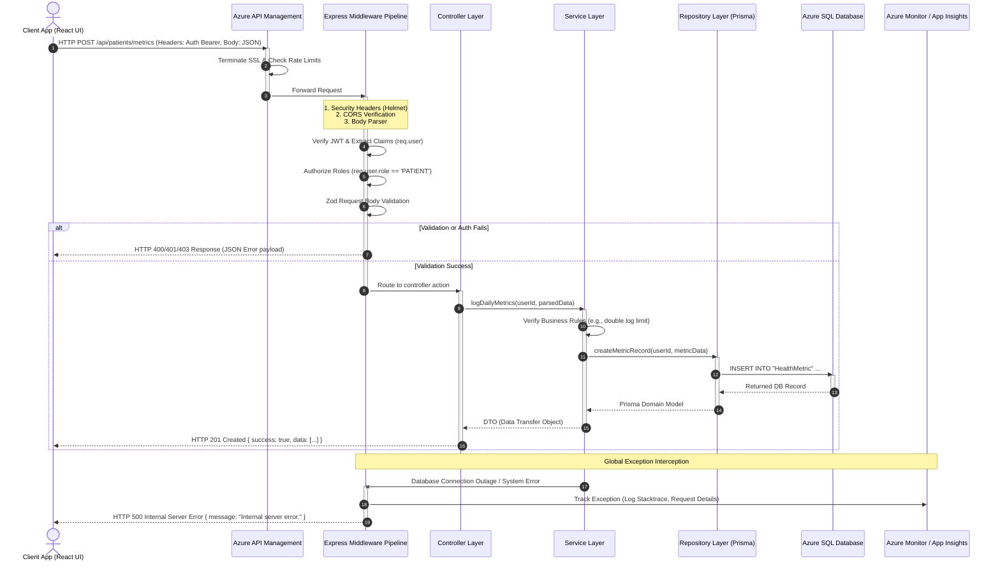

# Request Lifecycle & Request Flow

This document details the lifecycle of a request as it travels through the application, explaining the layers, middleware, validation logic, controllers, services, database interactions, and error handling.

---

## 1. Request Lifecycle Diagram



---

## 2. Explanation of Request Steps

### Step 1: Ingestion & Gateway Edge (Azure APIM)
The client web application initiates a request, which is intercepted at the network perimeter by **Azure API Management**. 
*   **Actions:** Enforces rate-limiting guidelines (e.g., max 100 requests per minute per IP), verifies SSL/TLS handshake certificates, and runs CORS checks.
*   **Routing:** Routes the traffic to the backend server pools.

### Step 2: Express Middleware Pipeline
Once the request enters the Node.js process, it is processed sequentially by Express middleware:
1.  **Security Initialization:** `helmet` sets HTTP headers to protect against common attacks like clickjacking and MIME-type sniffing.
2.  **JSON Parser:** Translates the raw binary body payload into a structured JavaScript object (`req.body`).
3.  **Authentication Middleware:** Extracts the Bearer token from the `Authorization` header, decrypts it, validates the cryptographic signature, and attaches the payload properties to `req.user`.
4.  **Authorization (RBAC) Middleware:** Checks `req.user.role` against the list of authorized roles specified for the target route. If unauthorized, returns `HTTP 403 Forbidden`.
5.  **Schema Validation (Zod):** Checks the request payload against a schema object:
    ```typescript
    const metricSchema = z.object({
      steps: z.number().int().min(0),
      sleepHours: z.number().min(0).max(24),
      waterIntakeMl: z.number().int().nonnegative()
    });
    ```
    If validation fails, a `ValidationError` is thrown, aborting downstream processing and returning a `HTTP 400 Bad Request` containing details of the failed fields.

### Step 3: Controller Layer
If the request satisfies authorization and validation, the router invokes the controller class method.
*   **Scope:** Controllers handle HTTP details. They parse URL tokens, extract query parameters, read request headers, and translate them into simple arguments for the service tier.
*   **Decoupling:** Controllers do not directly contact the database or execute core domain logic.

### Step 4: Service Layer
The controller invokes the corresponding service method.
*   **Scope:** The service implements the functional rules of the platform (e.g., checking if the patient has exceeded metrics thresholds, coordinating alerts, calling AI recommendation modules).
*   **Orchestration:** Services combine data access, call external systems, and trigger event systems.

### Step 5: Repository & Database Layer
The service accesses data through the database repository class.
*   **Scope:** The repository uses the Prisma API to write query files. The Prisma Engine compiles these commands into SQL, executes them within Azure SQL Database under transaction logs, and converts the results back into JavaScript entities.

### Step 6: Response Lifecycle & Serialization
*   **Normal Path:** The repository passes records back to the service. The service wraps database models into clean Data Transfer Objects (DTOs) to avoid leakage of database schemas to the UI. The controller serializes the DTO into JSON and executes `res.status(200).json(...)`.
*   **Error Path:** If an exception occurs (e.g., database timeout, custom validation error), it cascades to the Express **Global Error Handler** middleware.
    *   The error is classified (e.g., database error vs. client validation error).
    *   The complete stack trace is captured and sent asynchronously to **Azure Monitor (Application Insights)**.
    *   The client receives a sanitized, structured JSON response with a matching HTTP status code. No database queries, table names, or internal stack traces are returned to the user.
