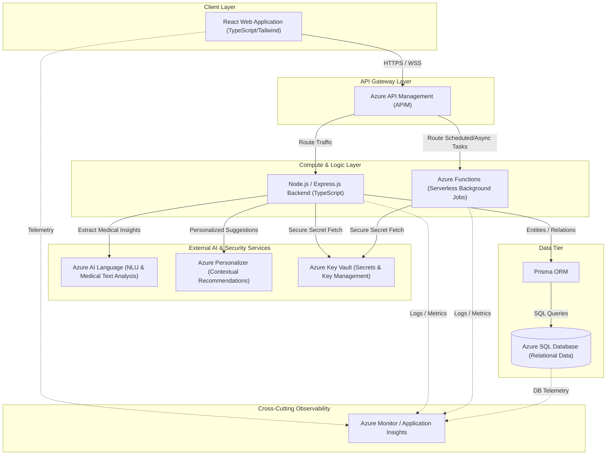

# System Architecture

## 1. System Overview
The **Personalized Healthcare and Wellness Platform** is a secure, cloud-native application designed to provide patients and clinicians with personalized health insights, digital appointment management, health metrics tracking, and AI-driven wellness recommendations. The system is built with a decoupled React frontend and a Node.js/Express backend, integrated with native Microsoft Azure services for security, scalability, serverless processing, and artificial intelligence.

---

## 2. High-Level Architecture
The platform is designed around a multi-tier cloud-native architecture consisting of:
1.  **Presentation Tier:** React SPA hosted securely on Azure App Service or static hosting, leveraging Tailwind CSS for styling and React Query for state synchronization.
2.  **API Gateway Tier:** Azure API Management (APIM) acting as the single entry point, managing API rate limiting, routing, SSL termination, and baseline security policies.
3.  **Application Logic Tier:**
    *   **Monolithic/Modular Backend:** Node.js/Express App Service handling the primary CRUD operations, business workflows, authentication, and core business rules.
    *   **Serverless Compute:** Azure Functions handling asynchronous, event-driven background processing (e.g., medication alerts, report processing, external API synchronizations).
4.  **Database & Storage Tier:** Azure SQL Database managed via Prisma ORM for relational schemas, transactional integrity, and data storage.
5.  **AI & Integration Tier:** Azure AI services (AI Language and Personalizer) executing real-time natural language processing and reinforcement-learning-based wellness recommendations.
6.  **Cross-Cutting Concerns:** Azure Key Vault for secrets management and Azure Monitor (with Application Insights) for end-to-end observability.

---

## 3. High-Level Architecture Diagram

---

## 4. Explanation of Every Layer

### 4.1 Client Layer
*   **Technology Stack:** React, TypeScript, Tailwind CSS, React Query.
*   **Role:** Serves as the interactive UI for Patients, Clinicians, and Administrators. It manages local UI state, routes client-side pages via React Router, and utilizes React Query to perform cache-first data fetching from the backend APIs.
*   **Communication:** Communicates with the backend exclusively via HTTPS/JSON routed through Azure API Management.

### 4.2 API Gateway Layer (Azure API Management)
*   **Role:** Acts as the gateway for all frontend clients. It provides API documentation, routes requests to appropriate backend modules or serverless functions, enforces rate-limiting policies to prevent Denial of Service (DoS) attacks, handles CORS policies, and validates incoming API tokens (JWTs) at the edge.

### 4.3 Compute & Logic Layer
*   **Node.js / Express.js Application Server:**
    *   Written in TypeScript and follows a strict modular structure.
    *   Hosts REST endpoints, enforces role-based access control, coordinates with AI services, and maps databases using the Prisma ORM.
*   **Azure Functions (Serverless Compute):**
    *   Executes asynchronous and background workflows such as scheduling medication reminders, sending push alerts, processing batch clinical reports, and pulling wearable device data.
    *   Operates on triggers (Timer, Queue, HTTP) to optimize cost and system responsiveness.

### 4.4 External AI & Security Services
*   **Azure Key Vault:** Centralizes storage of all API keys, connection strings, and JWT signing certificates. No secrets are stored in the source code or local server configuration files.
*   **Azure AI Language:** Used to process unstructured patient medical inputs, extract clinical terminology, perform sentiment analysis on health notes, and format structured health summaries.
*   **Azure Personalizer:** Employs reinforcement learning algorithms to recommend customized wellness activities, health goals, and dietary suggestions to patients based on their daily metrics and historical actions.

### 4.5 Data Tier
*   **Prisma ORM:** Serves as the Database Access Layer (DAL). It defines the schema declaratively, generates TypeScript types directly from the database model, and handles database connections, pooling, and ACID migrations.
*   **Azure SQL Database:** A fully managed relational database containing application schemas, user logins, transaction audits, medical charts, appointments, and telemetry records.

### 4.6 Observability Layer (Azure Monitor)
*   **Role:** Aggregates logs, traces, alerts, and performance metrics from the React frontend, Express backend, Azure Functions, and Azure SQL Database. Provides developers and administrators with unified dashboards and alerts for immediate diagnostic identification.
