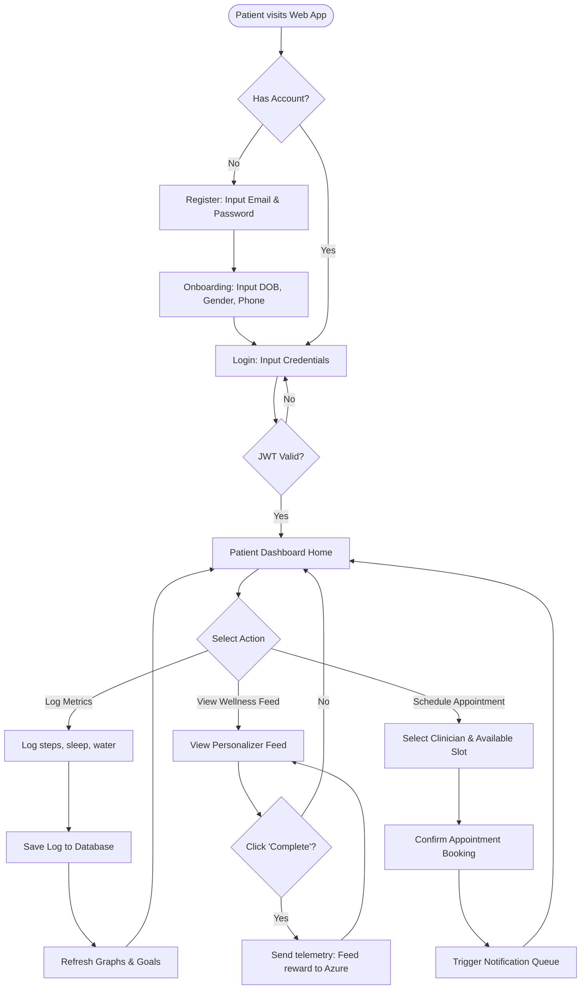
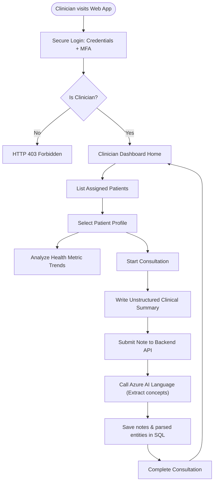
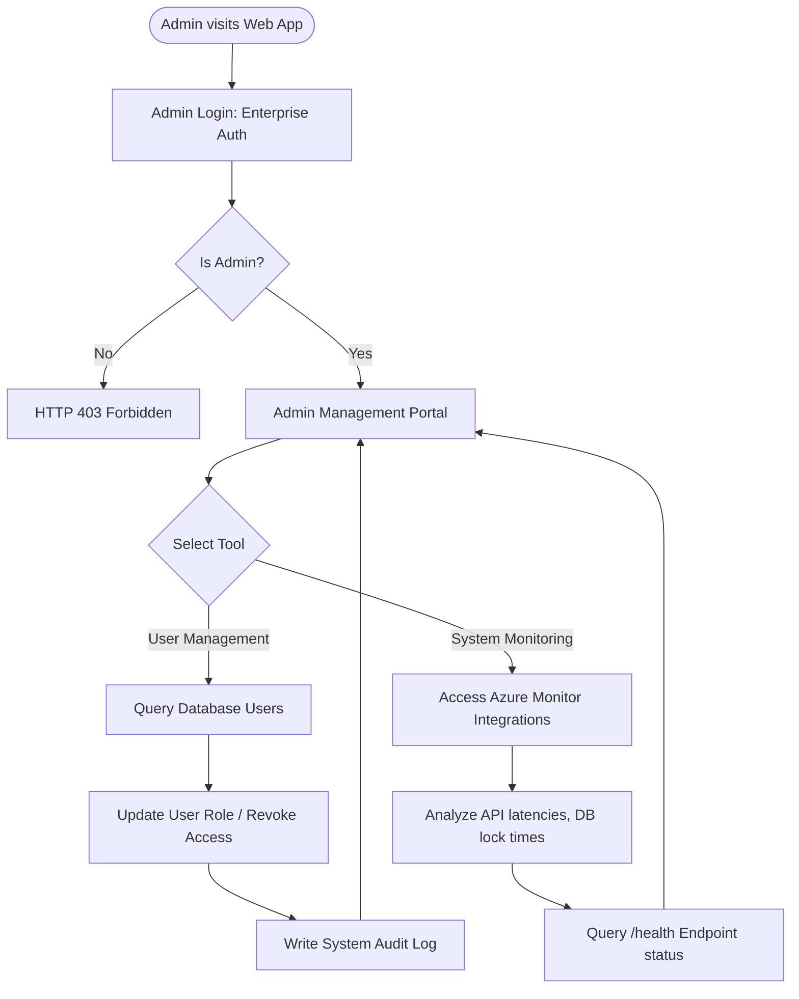

# User Journeys & Flows

This document details the user journeys and operational flows for the three primary system actors: Patients, Doctors, and Administrators.

---

## 1. Patient User Journey

### 1.1 Overview
The patient journey covers registration, onboarding, daily wellness journaling, reviewing AI-powered wellness feeds, and booking medical appointments.

### 1.2 Patient Flowchart

---

## 2. Doctor User Journey

### 2.1 Overview
The clinician journey covers accessing patient records, analyzing health charts, and logging clinical summaries during consults, which automates medical concept extraction.

### 2.2 Clinician Flowchart

---

## 3. Administrator User Journey

### 3.1 Overview
The admin journey covers access control governance, monitoring system operations, and managing API routes and integrations.

### 3.2 Administrator Flowchart

